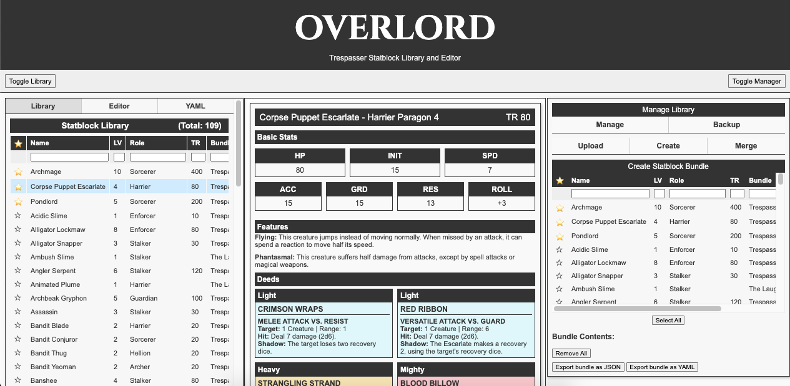

# OVERLORD: Statblock Library and Editor for Trespasser

OVERLORD is a web-based application designed to help you create, manage, and share statblocks for [Trespasser RPG](https://tundalus.itch.io/trespasser). With an intuitive interface and a host of built-in features, OVERLORD lets you view, edit, export, and organize your statblocks—all in one place.

## Overview

OVERLORD provides a complete workflow for managing your statblocks. Whether you’re creating new monsters, tweaking existing ones, or bundling statblocks into supplements, this app offers an integrated environment for all your needs. Key functions include:

- A visual statblock viewer with multiple export and share capabilities.
- An organized library to store and search your statblocks.
- An interactive editor with both form-based and YAML options.
- Tools for creating, uploading, and merging bundles.
- Local, offline storage with backup options to easily move your collection between devices.

## Core Features

- **Statblock Viewer**  
    View your statblocks in a clean, printable format. Export them as PDF or PNG files and share statblocks with friends via generated share links.
    
- **Statblock Library**  
    Create, collect, and organize your statblocks. Easily mark favorites, and filter or sort your collection by key attributes such as Name, Level, Role, TR, or Bundle.
    
- **Statblock Editor**  
    Use an interactive editor to build new statblocks or modify existing ones. The editor supports an arbitrary number features and deeds, giving you plenty of flexibility in designing your monsters.
    
- **YAML Editor**  
    For users who prefer direct data manipulation, the integrated YAML editor allows you to edit, copy, and paste statblock data. 
    
- **Statblock Bundles**  
    Create, Import, and manage statblock bundles to support homebrew supplements or easily share multiple statblocks with friends. Upload, merge, and export bundles in both JSON and YAML formats.
    
- **Library Backup**  
    Back up your entire collection with a single click. Export and import backups to ensure your statblocks are always safe.

    ---

## License

This project is licensed under the **MIT License**. For complete details, please see the [LICENSE.md](LICENSE.md) file.

## Attribution

- **js‑yaml (v4.1.0)**  
  **License:** MIT License  
  **Attribution:**  
  js‑yaml is a YAML 1.2 parser and serializer developed by nodeca.  
  © 2011–2015 Vitaly Puzrin and contributors.  
  [Full License Text](https://github.com/nodeca/js-yaml/blob/master/LICENSE)

- **Fuse.js (v6.6.2)**  
  **License:** Apache License 2.0  
  **Attribution:**  
  Fuse.js is a lightweight fuzzy-search library by Krisk.  
  © Krisk  
  [Full License Text](https://github.com/krisk/Fuse/blob/master/LICENSE)

- **html2canvas (v1.4.1)**  
  **License:** MIT License  
  **Attribution:**  
  html2canvas converts HTML to canvas screenshots.  
  © Niklas von Hertzen  
  [Full License Text](https://github.com/niklasvh/html2canvas/blob/master/LICENSE)

- **jsPDF (v2.5.1)**  
  **License:** MIT License  
  **Attribution:**  
  jsPDF enables PDF generation in JavaScript.  
  © 2010–2021 James Hall and yWorks GmbH  
  [Full License Text](https://github.com/MrRio/jsPDF/blob/master/LICENSE)

- **JSZip (v3.7.1)**  
  **License:** Dual‑licensed under MIT or GPLv3 (this project uses the MIT option)  
  **Attribution:**  
  JSZip is a library for creating, reading, and editing .zip files.  
  © 2009–2016 Stuart Knightley, David Duponchel, Franz Buchinger, and António Afonso  
  [Full MIT License Text](https://github.com/Stuk/jszip/blob/main/LICENSE.markdown)

- **lz‑string (v1.4.4)**  
  **License:** WTFPL (Do What The Fuck You Want To Public License)  
  **Attribution:**  
  lz‑string is a fast LZ-based compression algorithm.  
  [Full License Text](https://raw.githubusercontent.com/pieroxy/lz-string/master/LICENSE.txt)

- **Cinzel Font** (loaded via Google Fonts)  
  **License:** SIL Open Font License (OFL)  
  **Attribution:**  
  The “Cinzel” font is provided by Google Fonts under the SIL Open Font License.  
  Please refer to the [Google Fonts FAQ](https://developers.google.com/fonts/faq#what_license) or the [Cinzel page](https://fonts.google.com/specimen/Cinzel) for full details.
